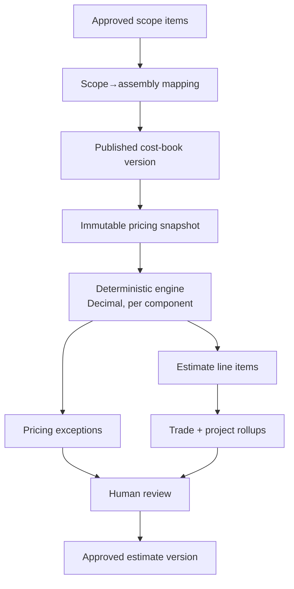

# Phase 4 — Versioned Cost Books, Trade Assemblies, Deterministic Pricing, Rollups

Phase 4 prices **approved** scope items from any trade using a shared, trade-agnostic
pricing core. Painting is the first complete reference assembly set; the
demonstration Concrete trade proves the architecture handles materially different
pricing (cubic-yard material, crew-hour labor, equipment). It is **not** a
Painting-only engine.

No AI performs pricing arithmetic. All money is `Decimal`. No real market prices are
bundled — cost books are populated by the user (fictional values in tests).

## Pipeline

```text
Approved scope items
      ↓
Trade registry  →  Trade-specific assembly mapping (deterministic; reviewer-confirmable)
      ↓
Versioned cost-book snapshot (immutable inputs)
      ↓
Deterministic pricing engine (Decimal; per-component)
      ↓
Validation + pricing exceptions (information / warning / blocking)
      ↓
Estimate version (immutable once approved)
      ↓
Trade + project rollups (reconciled)
      ↓
Human approval (blocked by blocking exceptions)
```



## Layers

**Shared pricing core** (`app/pricing`, `app/pricing_db.py`, `app/estimates`):
cost books + versions, cost sources, labor/production/material/equipment/subcontract/
other-direct inputs, crews, assemblies + components, scope→assembly mapping, the
deterministic engine, exceptions, indirect costs, ordered adjustments
(markup/margin/tax/overhead/profit/contingency), estimate versions + line items,
snapshots, rollups, exports, and CSV import.

**Trade modules** (`app/trades/<trade>/assemblies.py`, `pricing_validation.py`):
assembly templates (structure only — no prices), scope→assembly mapping rules, and
trade-specific pricing validation. The shared core contains **no** Painting-specific
assembly logic; it loads everything through the trade registry.

## Non-negotiables enforced

- AI never prices and never chooses hidden assumptions.
- Every rate carries a source + effective date; missing rates stay missing and
  surface as exceptions; unpriced scope stays visible (never silently dropped).
- Only **approved** scope items with trusted evidence are priced.
- Loaded labor and production rates are separate concepts; labor-hour and crew-hour
  production never mix.
- Markup ≠ margin (the user chooses; margin ≥ 100% is rejected).
- Contingency is explicit and separate in rollups.
- Published cost-book versions and approved estimate versions are immutable;
  repricing creates a new version; historical versions reprice from their stored
  snapshot independent of live data.
- Manual overrides require a reason and preserve the original value.
- No PDFs, payments, Stripe, or invoicing in this phase.

## Database (migrations 12–15)

`cost_books`, `cost_book_versions`, `cost_sources`, `labor_rates`, `crews`,
`production_rates`, `material_rates`, `equipment_rates`, `subcontract_quotes`,
`other_direct_costs`, `assemblies`, `assembly_components`, `scope_assembly_mappings`,
`estimates`, `estimate_versions`, `estimate_line_items`, `estimate_indirects`,
`estimate_adjustments`, `estimate_snapshots`, `estimate_review_events`. Existing data
is preserved.

## Recommended Phase 5

Proposal generation (PDF), bid leveling / subcontractor comparison, multi-currency,
historical-cost feedback loops, and an AI *assistant* that only *suggests* mappings
or flags anomalies for human confirmation — never priced arithmetic. See the README.
