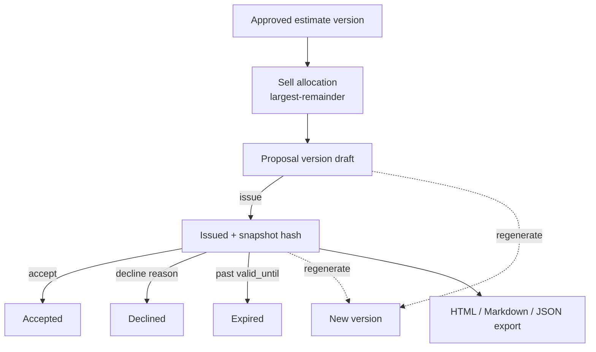

# Phase 5 — Deterministic Client-Facing Proposal Generation

Phase 5 turns an **approved** priced estimate (Phase 4) into a versioned, immutable,
client-facing **proposal**. Everything is deterministic Python — no AI generates
numbers or scope. Proposals show **sell prices and scope only**; internal cost
buildup, margins, rates, labor hours, and identifiers are never rendered.

## Pipeline

```text
Approved estimate version (Phase 4)
      ↓
Sell-price allocation (largest-remainder, exact reconciliation)
      ↓
Proposal version (draft)  →  issue (immutable + snapshot)  →  accepted / declined / expired
      ↓                                                          ↑
Regenerate → new version (supersedes prior, unless accepted) ────┘
      ↓
Exports: print-ready HTML · Markdown · JSON
```



## Guarantees

- A proposal can only be built from an **approved** estimate version (approval is
  blocked by blocking pricing exceptions, so proposals never carry unpriced scope).
- **Sell-only confidentiality:** proposal line items and all exports contain sell
  prices + scope narrative only — never cost, margin, overhead/profit, rates, or
  hours. Tests assert no cost terms leak into any export.
- **Exact reconciliation:** the estimate's final sell price is allocated across
  trades/lines in proportion to direct cost using the Hamilton (largest-remainder)
  method, so line/trade sells sum **exactly** to the total (no penny drift).
- **Immutable + reproducible:** issuing a version stores a normalized JSON snapshot +
  SHA-256; re-rendering is identical; regenerating creates a new version and
  supersedes the prior one (an already-**accepted** version is never superseded).
- **Lifecycle:** `draft → issued → accepted | declined | expired | superseded`.
  Accept/decline require an issued version; decline requires a reason; review history
  is append-only.
- **No payments/invoicing/CRM.** Exports are HTML (print-to-PDF ready), Markdown, and
  JSON — no external services and no new heavy dependencies.

## Detail levels

- `summary` — a single total + scope narrative.
- `trade` — one sell line per trade (default).
- `line` — one sell line per estimate line item.

## Database (migration 16)

`proposals`, `proposal_versions`, `proposal_line_items`, `proposal_snapshots`,
`proposal_review_events`. Existing data preserved.

## PDF

The HTML export is fully self-contained (inline CSS, no external resources) and
print-ready — "Print → Save as PDF" produces the PDF. A native PDF binary renderer is
intentionally deferred to avoid heavy dependencies.

## Recommended Phase 6

Subcontractor bid leveling, multi-currency + escalation, historical-cost feedback,
and an AI *assistant* that only suggests/flags for human confirmation (never priced
arithmetic). See the README.
